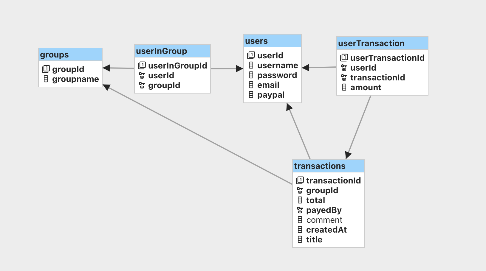

# Full Stack Challenge: Split the Bill

This is a full stack project inspired by the project "Divvyup" by Vinzenz Alb.
He wrote the original project in PHP with a postgres database.

Your challenge is to reimplemnt it with (a combination of) technologies you learnt this year. Chose your own tech stack!
Please consider and answer the following questions when you pick your tech stack:

* should we use a relational database or move to a document database like mongodb?
* should we split off the frontend from the backend?
* do we want to use a REST API? GraphQL API? something else?
* do we need server side rendering?
* do we need CMS functionality?
* is there business logic? where should it be implemented?
* is there UI logic? where should it be implemented?
* which "deep links" will we need (for example: share a link to a certain bill with a friend via SMS or signal)

for this challenge you can ignore
user authentication and authorization completely.

## Idea

A simple web app for groups of friends to share expenses.

## Screens

* [show one bill](http://bjelline.pages.mediacube.at/split_the_bill_public/show.html)
* [enter a new bill](http://bjelline.pages.mediacube.at/split_the_bill_public/form.html)
* [show all the bills and the current balance](http://bjelline.pages.mediacube.at/split_the_bill_public/index.html)

## Database

A group can contain many users, a user can be a member of many groups.

Each transaction belongs to a group. it stores the total amount and a
reference to the user who payed.

You can import this sql file into your database like this:

    psql -h db.xyz.supabase.co -U postgres -W postgres < database/split_the_bill.sql
    # -h hostname
    # -U username
    # -W   (means you will be asked for a password)
    # final argument = name of the databse

